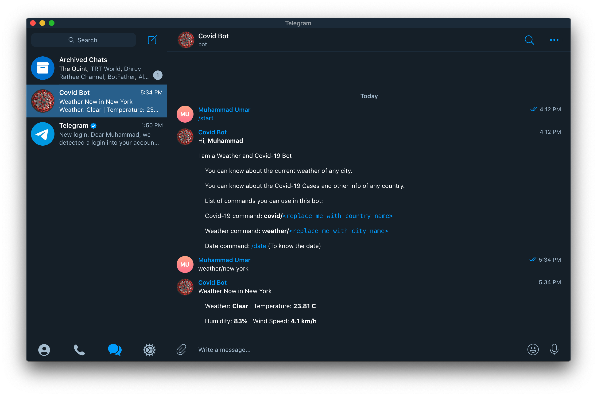

# Telegram Bot

  

> A Telegram Covid-19 Bot built-with Ruby

This is a Telegram Bot built using Ruby. You can get statistics and updates about Covid-19 for any country. You can also know the latest weather updates of any city.

## To Run the Project Locally

* Clone the Repo `git clone https://github.com/mohammadumar28/chat-bot.git`
* Run `cd chat-bot` to change directory to the cloned repo.
* Run `bundle install` to install all the gems in the project.
* Run `ruby bin/main.rb` to start the bot.
* Open the bot in a [Telegram app](https://telegram.org/apps) using this [link](https://t.me/chingani_bot)

## Note:

The bot has been already deployed to Heroku, So running the project locally might throw an error because **only 1** instance of the bot can run at a time.

## Bot Features/Commands

1. `/start` to get the welcome Message.
2. `covid/<country-name>` to get current Covid-19 stats for a country.
3. `weather/<city-name>` to get current weather for a city.
4. `/date` to know today's date.
5. `/help` to get the list of all commands and examples.

## Bot Link

* [Telegram Link](https://t.me/chingani_bot)

## Tools/Languages Used

* Ruby
* RSpec
* Heroku

## Author

**Muhammad Umar**
- Github: [@mohammadumar28](https://github.com/mohammadumar28)
- LinkedIn: [Muhammad Umar](https://www.linkedin.com/in/mohammadumar28/)
- Twitter: [@Mohammadumar28](https://twitter.com/Mohammadumar28)
- Telegram: [@mohammadumar28](https://t.me/mohammadumar28)
- Email: [mohammadumar28@gmail.com](mailto:mohammadumar28@gmail.com)

## Acknowledgements

* [Telegram API](https://core.telegram.org/api)
* [Telegram Bot Ruby](https://github.com/atipugin/telegram-bot-ruby)
* [Open Weather API](https://openweathermap.org/)
* [Novel Covid API](https://github.com/NovelCOVID/API)

## Contribution

* Fork this repo.
* Create your feature branch `git checkout -b my-new-feature`.
* Commit your changes `git commit -am "Add some feature"`.
* Push to the branch `git push origin my-new-feature`.
* Create a new Pull Request.
